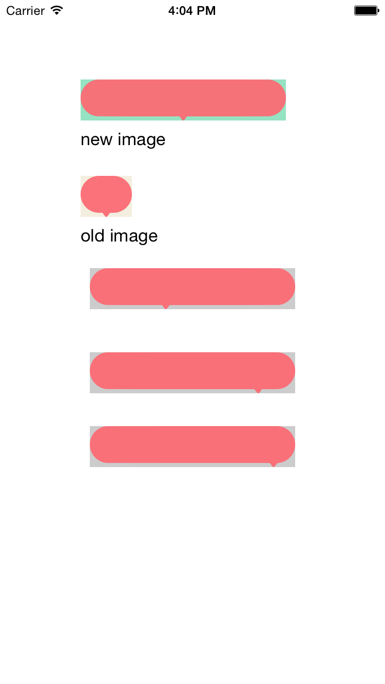

# DrawUIimage

CGRect big = CGRectMake(18, 8, 14, 24);

CGRect small = CGRectMake(20, 8, 10, 24);

//new Image eSize

CGSize bigSize = CGSizeMake(200, 40);

//new Image

UIImage *newImage = [oldImage resizableImageWithCapInsets:big smallInsets:small imageSize:bigSize];